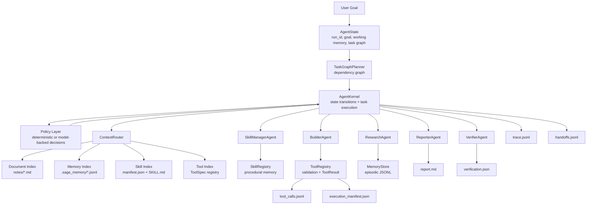

# SAGE: Scientific Agent Graph Engine

SAGE is a from-scratch agent runtime for building inspectable long-horizon agent workflows. It demonstrates how an agent system can turn a natural-language goal into a task graph, route context across documents, memory, tools, and skills, execute typed tools, coordinate specialist agents, and emit structured traces for reproducibility.

The runtime is implemented in plain Python with explicit state objects, typed tool contracts, local memory, skill manifests, handoff logs, artifact verification, and a pluggable policy layer. A deterministic policy keeps local runs reproducible, while model-backed policies can drive the same execution loop through OpenAI Responses or OpenAI-compatible Chat Completions endpoints.

## Execution Model

1. Parse the user goal into structured state.
2. Build a task graph.
3. Retrieve context across documents, memory, tools, and skills.
4. Select and compose reusable skills.
5. Execute typed tools through a registry.
6. Hand off state between specialist agents.
7. Write a report artifact and episodic memory.
8. Verify required artifacts.
9. Emit a structured trace.

```text
User Goal
   |
   v
AgentState
   |
   v
TaskGraphPlanner
   |
   v
ContextRouter
   |-- Document Index
   |-- Memory Index
   |-- Skill Index
   |-- Tool Index
   |
   v
AgentKernel
   |-- ResearchAgent
   |-- SkillManagerAgent
   |-- BuilderAgent
   |-- ReporterAgent
   |-- VerifierAgent
   |
   v
ToolRegistry + SkillRegistry + MemoryStore
   |
   v
Trace + Run Artifacts
```



## Runtime Components

| Component      | File                | Role                                                                                            |
| -------------- | ------------------- | ----------------------------------------------------------------------------------------------- |
| Agent kernel   | `kernel.py`         | Owns the run lifecycle, state transitions, task execution, and trace emission.                  |
| Agent state    | `state.py`          | Defines structured state, task nodes, tool calls, tool results, skills, memories, and handoffs. |
| Task graph     | `task_graph.py`     | Converts the goal into an executable dependency graph.                                          |
| Context router | `context_router.py` | Routes queries across document, memory, skill, and tool indexes.                                |
| Retrieval      | `rag.py`            | Provides deterministic keyword retrieval for inspectable local runs.                            |
| Memory store   | `memory.py`         | Stores episodic memory records in JSONL and supports retrieval.                                 |
| Tool registry  | `tools.py`          | Registers typed tools, validates inputs, normalizes outputs, and records calls.                 |
| Skill registry | `skills.py`         | Loads skill manifests, retrieves relevant skills, and composes skill plans.                     |
| Policy layer   | `policy.py`         | Provides deterministic, OpenAI Responses, and OpenAI-compatible Chat Completions policies.      |
| Handoffs       | `handoff.py`        | Logs explicit state transfer between specialist agents.                                         |
| Trace logger   | `trace.py`          | Writes structured JSONL events for each important runtime step.                                 |
| Verifier       | `verifier.py`       | Checks that required artifacts exist and JSON outputs are parseable.                            |

## Policy Layer

SAGE separates the runtime from the decision policy.

The runtime owns state, task execution, tool calls, memory writes, skill loading, handoffs, artifact verification, and trace logging. The policy decides how to refine goals, select skills, plan tool calls, draft reports, and summarize episodic memory.

The default deterministic policy is used for reproducible local smoke tests. Model-backed policies can drive the same runtime through OpenAI Responses or OpenAI-compatible Chat Completions endpoints.

## Multi-Index Context Routing

SAGE treats retrieval as part of the agent control plane, not only as document search. The context router retrieves across four local indexes:

| Index          | Source                                | What it gives the agent                    |
| -------------- | ------------------------------------- | ------------------------------------------ |
| Document index | `notes/*.md`                          | Task context and architecture notes.       |
| Memory index   | `.sage_memory/*.jsonl`                | Prior episodic records from previous runs. |
| Skill index    | `skills/*/manifest.json` + `SKILL.md` | Reusable procedural units.                 |
| Tool index     | `ToolRegistry` / `ToolSpec`           | Available actions and input/output contracts. |

This allows the agent to ask not only “what information is relevant?” but also “what memory, tool, or skill is useful for the next step?”

## Skills As Procedural Memory

In SAGE, a skill is a lightweight procedural memory unit. It is not an arbitrary code plugin. A skill describes reusable task procedure, constraints, required tools, input/output expectations, and validation checks.

```text
skills/<skill_name>/
  manifest.json
  SKILL.md
```

`manifest.json` contains machine-readable metadata. `SKILL.md` contains human-readable procedure instructions.

The runtime can load skills, retrieve relevant skills by goal/context, compose them into an ordered plan, and expose selected skill context to the active policy and specialist agents. Executable behavior remains in typed tools, which keeps the runtime safer and easier to inspect.

## Typed Tool Runtime

```text
ToolSpec
  -> input validation
  -> execution
  -> normalized ToolResult
  -> trace event
  -> AgentState update
```

Architecture tools:

- `validate_skill_contracts`: checks that selected skills reference tools registered in the `ToolRegistry`.
- `build_execution_manifest`: summarizes run id, task count, selected skills, retrieval counts, tool results, and artifact state.

`run_calculation` remains available as a compact smoke-test target for typed execution and structured error handling.

## Trace And Reproducibility

Running the architecture workflow creates an ignored local run directory:

```text
.sage_runs/run_001/
  run_config.json
  task_graph.json
  retrieved_context.json
  selected_skills.json
  execution_manifest.json
  tool_calls.jsonl
  handoffs.jsonl
  memory_writes.jsonl
  trace.jsonl
  report.md
  verification.json
```

These files are generated locally and are ignored by git. They allow a reviewer to inspect the task graph, selected skills, tool calls, handoffs, memory writes, execution trace, and verification result.

Example trace event:

```json
{
  "event_type": "tool_called",
  "actor": "BuilderAgent",
  "task_id": "T6",
  "status": "started",
  "input_summary": "build_execution_manifest(run_id, task_graph, retrieved_context, selected_skills)"
}
```

## Quickstart

### Local Deterministic Run

```bash
python -m pip install -e ".[dev]"
python examples/run_architecture_demo.py
python -m pytest -q
```

If Python is not 3.10+:

```bash
python3.10 -m pip install -e ".[dev]"
python3.10 examples/run_architecture_demo.py
python3.10 -m pytest -q
```

### OpenAI Responses Policy

```bash
export OPENAI_API_KEY="..."
python examples/run_agent.py \
  --policy openai \
  --model your-model-name
```

### OpenAI-Compatible Chat Completions Policy

```bash
export OPENAI_API_KEY="..."
python examples/run_agent.py \
  --policy openai-chat \
  --base-url https://api.example.com/v1 \
  --model provider-model-name
```

The key is read from the process environment and is never required for deterministic local execution.

## Inspecting A Run

After running the workflow:

1. Open `.sage_runs/run_001/task_graph.json` to inspect the task DAG.
2. Open `.sage_runs/run_001/selected_skills.json` to inspect skill retrieval and composition.
3. Open `.sage_runs/run_001/execution_manifest.json` to inspect the run manifest.
4. Open `.sage_runs/run_001/tool_calls.jsonl` to inspect typed tool execution.
5. Open `.sage_runs/run_001/handoffs.jsonl` to inspect specialist-agent handoffs.
6. Open `.sage_runs/run_001/trace.jsonl` to inspect the full event stream.
7. Open `.sage_runs/run_001/verification.json` to confirm artifact verification.

## Capability Matrix

| Capability   | Current implementation                                              | Extension path                                             |
| ------------ | ------------------------------------------------------------------- | ---------------------------------------------------------- |
| Model policy | Deterministic, OpenAI Responses, OpenAI-compatible Chat Completions | Add local models or other provider policies.               |
| RAG          | Local multi-index retrieval over docs, memory, skills, and tools    | Add URL/PDF loaders into the document index.               |
| Memory       | JSONL episodic memory                                               | Add vector memory, summarization, or retention policies.   |
| Skills       | Local procedural memory with manifests and `SKILL.md`               | Add executable skill graphs bound to ToolRegistry actions. |
| Tools        | Typed registry with validation and structured results               | Add permissioned network, file, or code-execution tools.   |
| Handoffs     | Explicit specialist-agent state transfer                            | Add dynamic routing policies.                              |
| Tracing      | JSONL events and run artifacts                                      | Add UI or OpenTelemetry-style exporters.                   |

See `docs/extension_points.md` for planned extension boundaries.

## Smoke Tests

1. Kernel boot
2. Context routing
3. Memory roundtrip
4. Typed tool call
5. Skill retrieval and composition
6. Architecture tool contracts and execution manifest
7. End-to-end architecture run
8. Policy construction without network calls

## Repository Layout

```text
src/scientific_agent_from_scratch/
  kernel.py          # runtime core and task execution loop
  state.py           # AgentState, TaskNode, ToolSpec, SkillSpec, MemoryRecord
  task_graph.py      # deterministic DAG planner for the architecture workflow
  context_router.py  # multi-index retrieval over docs, memory, tools, skills
  rag.py             # deterministic keyword retrieval
  memory.py          # JSONL episodic memory store
  tools.py           # typed tool registry and safe tool execution
  skills.py          # skill loading, retrieval, and composition
  policy.py          # deterministic and model-backed policy backends
  agents.py          # specialist agents
  handoff.py         # structured handoff logging
  trace.py           # JSONL trace logger
  verifier.py        # artifact verification
```

## Design Scope

SAGE is designed as a local, inspectable runtime. The default execution policy is deterministic so that traces and artifacts can be reproduced exactly. The same runtime boundaries support model-backed policies, while the core framework stays dependency-light and easy to inspect.
