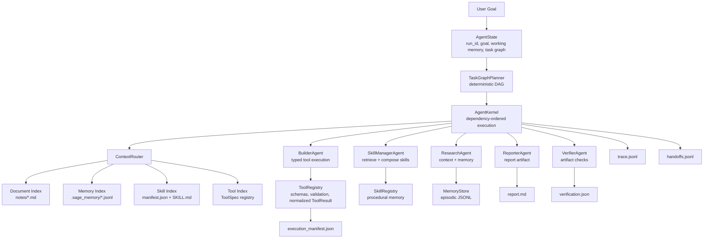

# SAGE: Scientific Agent Graph Engine

SAGE is a from-scratch agent runtime for building inspectable long-horizon agent workflows. It demonstrates how an agent system can turn a natural-language goal into a task graph, route context across documents, memory, tools, and skills, execute typed tools, coordinate specialist agents, and emit structured traces for reproducibility.

The runtime is implemented in plain Python with explicit state objects, typed tool contracts, local memory, skill manifests, handoff logs, and artifact verification. A deterministic policy keeps local runs reproducible, while pluggable model-backed policies can drive the same execution loop through OpenAI Responses or OpenAI-compatible Chat Completions endpoints.

## Execution Model

1. Parse the user goal into structured state.
2. Build a task graph.
3. Retrieve context across documents, memory, tools, and skills.
4. Select and compose reusable skills.
5. Execute typed tools through a registry.
6. Hand off state between specialist agents.
7. Write a report artifact and episodic memory.
8. Verify required artifacts.
9. Emit a structured trace.

```text
User Goal
   |
   v
AgentState
   |
   v
TaskGraphPlanner
   |
   v
ContextRouter
   |-- Document Index
   |-- Memory Index
   |-- Skill Index
   |-- Tool Index
   |
   v
AgentKernel
   |-- ResearchAgent
   |-- SkillManagerAgent
   |-- BuilderAgent
   |-- ReporterAgent
   |-- VerifierAgent
   |
   v
ToolRegistry + SkillRegistry + MemoryStore
   |
   v
Trace + Run Artifacts
```



## Runtime Components

| Component | File | Role |
|---|---|---|
| Agent kernel | `kernel.py` | Owns the run lifecycle, state transitions, task execution, and trace emission. |
| Agent state | `state.py` | Defines structured state, task nodes, tool calls, tool results, skills, memories, and handoffs. |
| Task graph | `task_graph.py` | Converts the goal into an executable dependency graph. |
| Context router | `context_router.py` | Routes queries across document, memory, skill, and tool indexes. |
| Retrieval | `rag.py` | Provides deterministic keyword retrieval for inspectable local runs. |
| Memory store | `memory.py` | Stores episodic memory records in JSONL and supports retrieval. |
| Tool registry | `tools.py` | Registers typed tools, validates inputs, normalizes outputs, and records calls. |
| Skill registry | `skills.py` | Loads skill manifests, retrieves relevant skills, and composes skill plans. |
| Policy layer | `policy.py` | Provides deterministic, OpenAI Responses, and OpenAI-compatible Chat Completions policies. |
| Handoffs | `handoff.py` | Logs explicit state transfer between specialist agents. |
| Trace logger | `trace.py` | Writes structured JSONL events for each important runtime step. |
| Verifier | `verifier.py` | Checks that required artifacts exist and JSON outputs are parseable. |

## Multi-Index Context Routing

SAGE does not use retrieval only as document search. The context router retrieves across four local indexes:

- Documents: architecture notes and task context.
- Memory: prior episodic records from previous runs.
- Skills: reusable procedural units loaded from `skills/`.
- Tools: registered tool specs and usage contracts.

This allows the agent to ask not only “what information is relevant?” but also “what memory, tool, or skill is relevant for the next task?”

## Skills As Procedural Memory

In SAGE, a skill is a lightweight procedural memory unit. Each skill has a `manifest.json` for machine-readable metadata and a `SKILL.md` file for human-readable procedure instructions.

```text
skills/<skill_name>/
  manifest.json
  SKILL.md
```

Each manifest includes:

- `name`
- `description`
- `when_to_use`
- `required_tools`
- `inputs`
- `outputs`
- `validation`

The `SkillRegistry` can retrieve relevant skills and compose them into an ordered execution plan. This makes skills part of the runtime, not just documentation.

## Typed Tool Runtime

```text
ToolSpec
  -> input validation
  -> execution
  -> normalized ToolResult
  -> trace event
  -> AgentState update
```

The architecture run exercises deterministic local tools that validate skill/tool contracts and build a reproducibility manifest:

- `validate_skill_contracts`: checks that selected skills reference tools registered in the `ToolRegistry`.
- `build_execution_manifest`: summarizes run id, task count, selected skills, retrieval counts, tool results, and artifact state.

The lower-level `run_calculation` tool remains available as a compact smoke-test target for typed execution and structured error handling.

## Trace And Reproducibility

Running the architecture workflow creates an ignored local run directory:

```text
.sage_runs/run_001/
  run_config.json
  task_graph.json
  retrieved_context.json
  selected_skills.json
  execution_manifest.json
  tool_calls.jsonl
  handoffs.jsonl
  memory_writes.jsonl
  trace.jsonl
  report.md
  verification.json
```

Example trace event:

```json
{
  "event_type": "tool_called",
  "actor": "BuilderAgent",
  "task_id": "T6",
  "status": "started",
  "input_summary": "build_execution_manifest(run_id, task_graph, retrieved_context, selected_skills)"
}
```

## Quickstart

```bash
python -m pip install -e ".[dev]"
python examples/run_architecture_demo.py
python -m pytest -q
```

If `python` is not Python 3.10 or newer on your system, use an explicit interpreter:

```bash
python3.10 -m pip install -e ".[dev]"
python3.10 examples/run_architecture_demo.py
python3.10 -m pytest -q
```

To run with an OpenAI-compatible Chat Completions provider:

```bash
export OPENAI_API_KEY="..."
python examples/run_agent.py \
  --policy openai-chat \
  --base-url https://api.example.com/v1 \
  --model provider-model-name
```

The key is read from the process environment and is never required for deterministic local execution.

## Inspecting A Run

After running the workflow:

1. Open `.sage_runs/run_001/task_graph.json` to inspect the task DAG.
2. Open `.sage_runs/run_001/selected_skills.json` to inspect skill retrieval and composition.
3. Open `.sage_runs/run_001/tool_calls.jsonl` to inspect typed tool execution.
4. Open `.sage_runs/run_001/handoffs.jsonl` to inspect specialist-agent handoffs.
5. Open `.sage_runs/run_001/trace.jsonl` to inspect the full event stream.
6. Open `.sage_runs/run_001/verification.json` to confirm artifact verification.

## Smoke Tests

1. Kernel boot
2. Context routing
3. Memory roundtrip
4. Typed tool call
5. Skill retrieval and composition
6. Architecture tool contracts and execution manifest
7. End-to-end architecture run

## Repository Layout

```text
src/scientific_agent_from_scratch/
  kernel.py          # runtime core and task execution loop
  state.py           # AgentState, TaskNode, ToolSpec, SkillSpec, MemoryRecord
  task_graph.py      # deterministic DAG planner for the architecture workflow
  context_router.py  # multi-index retrieval over docs, memory, tools, skills
  rag.py             # deterministic keyword retrieval
  memory.py          # JSONL episodic memory store
  tools.py           # typed tool registry and safe tool execution
  skills.py          # skill loading, retrieval, and composition
  policy.py          # deterministic and model-backed policy backends
  agents.py          # specialist agents
  handoff.py         # structured handoff logging
  trace.py           # JSONL trace logger
  verifier.py        # artifact verification
```

## Design Scope

SAGE is designed as a local, inspectable runtime. The default execution policy is deterministic so that traces and artifacts can be reproduced exactly. The same runtime boundaries support model-backed policies, while the core framework stays dependency-light and easy to inspect.
